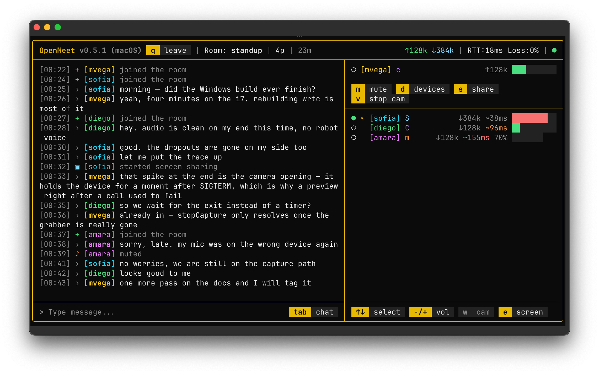

# OpenMeet

[](https://github.com/manuelvegadev/openmeet/releases/latest)
[](https://github.com/manuelvegadev/openmeet/actions/workflows/go-client.yml)
[](https://github.com/manuelvegadev/openmeet/actions/workflows/ci.yml)
[](#license)

Lightweight, self-hosted audio/video conferencing from the terminal. Create or join a room, talk over Opus, share your screen or camera, and chat — peer to peer, no account, one 12 MB binary.



The project has two parts:

- **Client** — a single static binary for macOS and Windows, written in Go ([`packages/go`](packages/go/README.md))
- **Server** — a small Express + WebSocket signaling server (no database, no auth)

## Install

```bash
# macOS (Apple Silicon)
curl -fsSL https://openmeet.manuelvega.dev/install | bash
```

```powershell
# Windows 11 (PowerShell) — also registers a Windows Terminal profile and a desktop shortcut
irm https://openmeet.manuelvega.dev/install.ps1 | iex
```

Both are redirects to the installer in the latest release, so the URL never changes.

Then `openmeet`. Nothing else is needed for a call; screen and camera sharing need [ffmpeg](https://ffmpeg.org) (`brew install ffmpeg` / `winget install Gyan.FFmpeg`, which the Windows installer does). The app keeps itself current from GitHub Releases: a newer version downloads in the background and the home screen offers `r` to restart into it. The binaries are also on the [releases page](https://github.com/manuelvegadev/openmeet/releases) with their SHA-256 sums.

## Features

- **Audio calls** — WebRTC peer-to-peer mesh (up to 6 participants), Opus at 48 kHz with in-band FEC and concealment, **encoded once and sent to everyone**, so a call costs the same with two people as with six
- **A voice gate** — nothing is sent while you are silent, which is most of a call
- **Devices that follow the system** — Bluetooth headphones that switch profile mid-call are reopened, not left robotic; Apple's Voice Isolation and echo cancellation are on by default on macOS; Wave Link and NVIDIA Broadcast are recognised and offered first
- **Screen and camera** — hardware H.264 (VideoToolbox on the Mac, NVENC on Windows), the screen in its own aspect ratio up to 1080 px on the short side at 30 fps, the camera up to 720 px, each on its own track, encoded once for the room; received in native ffplay windows
- **Chat** — one conversation: messages and room events (joins, mutes, shares) in a single stream
- **Per-peer volume, speaking dots and latency estimates**
- **Pick a name and a colour, once** — no sign-up; you show up as `[name]` in your colour for everyone
- **Reconnection** — the signaling link comes back with backoff and the room is rejoined
- **Light** — one process at about 4% of one core and 35 MB in a call, interface included, on an M4 Pro; 1.25% on an i7-9700K ([docs/performance.md](docs/performance.md))

## Platforms

| Platform | Status | Features |
|----------|--------|----------|
| macOS 15 (Sequoia) or later, Apple Silicon | Supported | Audio, chat, camera, screen sharing |
| Windows 11 (x64) | Supported | Audio, chat, screen sharing. Camera not available yet |
| Linux | Paused | The code compiles; nothing is built or tested |

One version number for every platform, in [`packages/go/VERSION`](packages/go/VERSION). Version 1.0 will mean feature parity between macOS and Windows.

## Architecture

```
Client A <──WebRTC P2P──> Client B
   ↑                         ↑
   │   WebSocket (signaling) │
   └──────> Server <─────────┘
              │
        In-memory Maps
```

- **Signaling** — WebSocket server relays SDP offers/answers and ICE candidates
- **Media** — direct P2P connections between clients (no SFU/MCU); audio and video never touch the server
- **Storage** — in-memory Maps for rooms and participants (ephemeral by design)

See [docs/websocket-webrtc-architecture.md](docs/websocket-webrtc-architecture.md) for the full signaling and WebRTC flow, and [docs/performance.md](docs/performance.md) for what the client costs and how those numbers were taken.

## Tech Stack

| Layer | Technology |
|-------|-----------|
| Client | Go, pion/webrtc, libopus (static), miniaudio (CoreAudio / WASAPI), Apple Voice Processing I/O, Bubble Tea, ffmpeg/ffplay |
| Server | Express 5, ws (WebSocket), Node.js 22 |
| Shared types | TypeScript |
| Monorepo | pnpm workspaces (server, shared, website) + a Go module |
| Lint/format | Biome (TypeScript), gofmt / go vet |
| Containerization | Docker (multi-stage Alpine build, server only) |

## Project Structure

```
openmeet/
├── packages/
│   ├── go/              # the client: one static binary (cmd/openmeet, internal/*)
│   ├── shared/          # TypeScript types (WebSocket messages, Room, Participant)
│   ├── server/          # Express + WebSocket signaling + chat
│   ├── website/         # openmeet.manuelvega.dev, static landing page (English and Spanish)
│   └── terminal/        # the retired Node/Ink client, kept as the reference the Go one was drawn from
├── Dockerfile
├── docker-compose.yml
└── pnpm-workspace.yaml
```

## Development

### Client

```bash
brew install cmake pkg-config          # libopus is built once, statically, under packages/go/.cross
packages/go/scripts/build.sh           # → packages/go/openmeet
packages/go/openmeet --server ws://localhost:3001/ws
cd packages/go && go test ./...        # includes the golden frames of every screen
brew install zig && packages/go/scripts/build-windows.sh   # → packages/go/dist/windows-amd64/openmeet.exe
```

Everything else about the client — flags, releasing, how the updater works, what it costs and why — is in [packages/go/README.md](packages/go/README.md).

### Server

```bash
pnpm install
pnpm dev            # server on :3001 and the shared package in watch mode
pnpm build          # shared → server
pnpm lint           # Biome
```

## Deployment

### Docker

```bash
docker compose up --build
# or
docker build -t openmeet .
docker run -p 3001:3001 openmeet
```

The production container runs the signaling server on port **3001**. Point clients at it with `openmeet --server ws://your-host:3001/ws`.

### Manual

```bash
pnpm install
pnpm build
NODE_ENV=production node packages/server/dist/index.js
```

### Environment Variables

| Variable | Default | Description |
|----------|---------|-------------|
| `PORT` | `3001` | Server port |

## Network Notes

- Uses Google STUN servers for NAT traversal
- Works on the same LAN or when at least one peer has a public IP
- For calls across restrictive NATs, you'll need a TURN server (not included)
- Audio packets are marked DSCP EF (and `SO_NET_SERVICE_TYPE` voice on macOS) so routers that honour it put the call first

## The Node client

`openmeet-terminal` on npm was the client until September 2026 and is retired: no further versions are published, and [`packages/terminal`](packages/terminal/README.md) stays in the tree only as the reference the Go client was drawn from, cell for cell. Its last version still works against the same server, without video towards Go peers (it has no H.264).

## License

MIT
